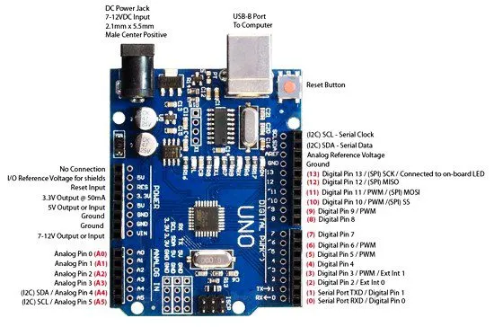

## **Clase: Introducción a los Microcontroladores – Arduino I**

### 🎯 Objetivos de Aprendizaje

Al finalizar la clase, el estudiante será capaz de:

1. Comprender qué es un microcontrolador y sus diferencias con otros dispositivos electrónicos.
2. Identificar las partes y funciones básicas de una placa Arduino.
3. Configurar el entorno de desarrollo Arduino IDE.
4. Realizar su primer programa en Arduino para encender y apagar un LED.

---

## **1. Introducción Teórica**

### 1.1. ¿Qué es un microcontrolador?

Un **microcontrolador** es un circuito integrado que contiene:

* **CPU** (Unidad Central de Procesamiento)
* **Memoria** (RAM, Flash, EEPROM)
* **Periféricos de Entrada/Salida** (GPIO, ADC, PWM, UART, I2C, SPI)

Se utiliza para **controlar dispositivos electrónicos** y realizar tareas específicas.

📌 **Diferencias con una computadora:**

* Un microcontrolador ejecuta **una tarea específica**.
* Consume **menos energía**.
* Tiene **recursos limitados** (menos memoria y velocidad).
* Está diseñado para integrarse en **dispositivos y sistemas embebidos**.

---

### 1.2. ¿Qué es Arduino?

**Arduino** es una plataforma de hardware y software de código abierto que facilita:

* El **diseño** y **programación** de microcontroladores.
* La conexión con sensores, actuadores y otros dispositivos.
* La creación de **prototipos** de forma rápida.

---

### 1.3. Partes principales de un Arduino UNO

* **Microcontrolador ATmega328P**
* **Pines Digitales (0-13)**
* **Pines Analógicos (A0-A5)**
* **Puerto USB** (alimentación y programación)
* **Alimentación externa** (Jack 7–12V)
* **LED integrado en el pin 13**
* **Botón Reset**



---

### 1.4. Aplicaciones comunes

* Automatización de tareas.
* Robótica.
* Monitoreo de sensores (temperatura, humedad, luz).
* Control de luces y motores.
* Proyectos educativos.

---

## **2. Entorno de Desarrollo (Arduino IDE)**

### 2.1. Instalación del Arduino IDE

1. Descargar desde [https://www.arduino.cc](https://www.arduino.cc)
2. Instalar siguiendo el asistente.
3. Conectar Arduino mediante cable USB.

---

### 2.2. Configuración inicial

* **Seleccionar placa:** *Herramientas → Placa → Arduino UNO*
* **Seleccionar puerto:** *Herramientas → Puerto → (COMxx o /dev/ttyUSBx)*
* Verificar que esté correctamente conectado.

---

## **3. Primer Proyecto: Parpadeo de LED (Blink)**

### 3.1. Código básico

```cpp
// Programa: Blink
// Hace parpadear el LED integrado en la placa

void setup() {
  pinMode(LED_BUILTIN, OUTPUT); // Configura el pin del LED como salida
}

void loop() {
  digitalWrite(LED_BUILTIN, HIGH); // Enciende LED
  delay(1000); // Espera 1 segundo
  digitalWrite(LED_BUILTIN, LOW); // Apaga LED
  delay(1000); // Espera 1 segundo
}
```

---

### 3.2. Explicación del código

* **setup()**: Se ejecuta una sola vez al inicio.
* **loop()**: Se repite indefinidamente.
* **pinMode**: Define si un pin será entrada o salida.
* **digitalWrite**: Envía señal alta o baja al pin.
* **delay(ms)**: Pausa el programa en milisegundos.

---

### 3.3. Ejecución

1. Escribir o pegar el código en el IDE.
2. Guardar el archivo.
3. Cargar el programa en la placa (*Botón Subir*).
4. Observar el LED parpadear.

---

## **4. Actividad práctica guiada**

**Objetivo:** Modificar el programa para que el LED parpadee más rápido o más lento.

* Cambiar `delay(1000)` a `delay(200)` para parpadeo rápido.
* Probar con `delay(2000)` para parpadeo lento.

---

## **5. Evaluación rápida**

1. ¿Qué diferencia hay entre un microcontrolador y una computadora?
2. ¿Cuál es la función del puerto USB en Arduino UNO?
3. En el código Blink, ¿qué hace la función `pinMode()`?
4. ¿Qué sucede si cambiamos `delay(1000)` a `delay(100)`?

---

## **6. Tarea**

Investigar:

* **Sensores** que pueden conectarse a Arduino.
* **Actuadores** controlables desde Arduino.

