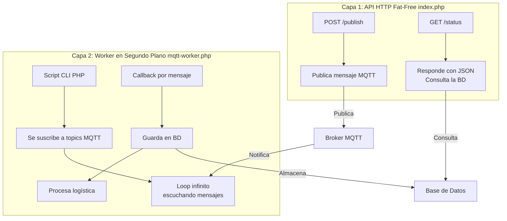

¡Excelente pregunta! Es un punto crucial que toca un error conceptual común al trabajar con MQTT y APIs HTTP. Voy a explicarte por qué **crear un endpoint POST `/subscribe` en `index.php` es una mala idea** en este contexto y cuál es la forma correcta de hacerlo.

---

### ❌ **El Problema Fundamental: Bloquerío y Escalabilidad**

El endpoint `/subscribe` que propuse en el ejemplo anterior es **técnicamente incorrecto** para una suscripción MQTT de larga duración. Aquí el por qué:

1.  **Una petición HTTP es efímera:** Un cliente HTTP (como un navegador o la herramienta `curl`) hace una solicitud POST y espera una respuesta. Una vez que el servidor envía la respuesta, la conexión se **cierra**. MQTT, por el contrario, necesita una conexión **persistente y abierta** para escuchar mensajes de forma continua.

2.  **El método `$mqtt->loop(true)` es bloqueante:** Cuando llamas a este método en el controlador, el proceso de PHP se queda esperando indefinidamente por mensajes MQTT. Esto significa:
    *   La petición HTTP **nunca terminará**, el cliente se quedará "colgado" esperando una respuesta que nunca llega.
    *   **Bloqueará un worker** completo de tu servidor web (Apache, Nginx + PHP-FPM). Si tienes 10 workers y 10 personas llaman a `/subscribe`, tu servidor web se quedará sin recursos y dejará de responder a otras peticiones.

3.  **No es escalable:** No puedes tener miles de clientes HTTP manteniendo una conexión abierta simultáneamente. Agotarías los recursos del servidor muy rápido.

---

### ✅ **La Solución Correcta: Separar las Responsabilidades**

La arquitectura correcta implica separar completamente la lógica de la **API HTTP** de la lógica del **Cliente Suscriptor MQTT**.

#### **Capa 1: API HTTP (index.php) - Para Publicar y Comandos**
*   **Función:** Recibe peticiones HTTP breves, realiza una acción (como publicar un mensaje MQTT) y responde inmediatamente.
*   **Endpoints válidos:**
    *   `POST /publish` → Publica un mensaje en un topic y responde `{"status": "success"}`.
    *   `GET /sensor/@id` → Consulta el último estado de un sensor desde una base de datos (no escuchando MQTT).
    *   `POST /semaphore/control` → Publica un comando para cambiar un semáforo.

#### **Capa 2: Worker de Suscripción MQTT (mqtt-worker.php) - Para Escuchar**
*   **Función:** Es un **script de línea de comandos (CLI)** que se ejecuta de forma independiente y permanente en segundo plano.
*   **Cómo funciona:**
    1.  Se conecta al broker MQTT.
    2.  Se suscribe a los topics que le interesan (ej: `logistica/entrada/#`, `vehiculos/+/posicion`).
    3.  Entra en un loop infinito (`->loop(true)`) escuchando mensajes.
    4.  Cuando un mensaje llega, su callback **toma acciones sin involucrar la API HTTP**:
        *   Guardar los datos en una base de datos (MySQL, InfluxDB).
        *   Procesar la lógica de negocio.
        *   Enviar una notificación push (ej: con WebSockets).
        *   Llamar a *otro* endpoint de la API *internamente* si es necesario.



---

### 🔧 **Cómo Debería Quedar el Código**

**1. `index.php` (Solo para publicar):**
```php
<?php
require 'vendor/autoload.php';

$f3 = \Base::instance();
$mqttService = App\Services\MqttService::getInstance();

// ENDPOINT PARA PUBLICAR - ¡Este sí es válido!
$f3->route('POST /publish', function($f3) use ($mqttService) {
    $topic = $f3->get('POST.topic');
    $message = $f3->get('POST.message');
    
    $mqttService->publish($topic, $message);
    
    echo json_encode(['status' => 'success', 'message' => 'Mensaje publicado']);
});

// ELIMINA el endpoint /subscribe de aquí

$f3->run();
?>
```

**2. `mqtt-worker.php` (El suscriptor real):**
```php
<?php
require 'vendor/autoload.php';

$mqttService = App\Services\MqttService::getInstance();
$db = new \DB\SQL('mysql:host=localhost;dbname=test', 'user', 'password');

// Suscripción para logística
$mqttService->subscribe('logistica/entrada/@id', function ($topic, $message) use ($db) {
    // 1. Procesar el mensaje
    $data = json_decode($message, true);
    $id = explode('/', $topic)[2]; // Extrae el ID dinámico del topic
    
    // 2. Guardar en Base de Datos (acción no bloqueante para la API)
    $db->exec(
        'INSERT INTO log_entradas (sensor_id, mensaje) VALUES (?, ?)',
        [$id, $message]
    );
    
    // 3. Puedes publicar otro mensaje como confirmación si es necesario
    // $mqttService->publish("logistica/confirmacion/$id", "OK");
    
    echo "[LOG] Entrada registrada desde $topic: $message\n";
});

// Mantiene el script vivo escuchando para siempre
$mqttService->loop(true);
?>
```

**3. Gestionar el worker con Supervisor:**
Como se mencionó antes, usas Supervisor para asegurarte de que el worker siempre esté corriendo, incluso si se cae.

```bash
# Instalar Supervisor (ejemplo en Ubuntu)
sudo apt-get install supervisor

# Crear un archivo de configuración para tu worker
sudo nano /etc/supervisor/conf.d/mqtt-worker.conf
```
Contenido del archivo:
```conf
[program:mqtt-worker]
command=php /ruta/completa/a/tu/proyecto/mqtt-worker.php
directory=/ruta/completa/a/tu/proyecto
autostart=true
autorestart=true
stderr_logfile=/var/log/mqtt-worker.err.log
stdout_logfile=/var/log/mqtt-worker.out.log
user=www-data
```
Luego, recarga y inicia el worker:
```bash
sudo supervisorctl reread
sudo supervisorctl update
sudo supervisorctl start mqtt-worker
```

---

### 🧠 **Conclusión: Por qué se me ocurrió ponerlo inicialmente**

Incluí el endpoint `/subscribe` en el primer ejemplo como una forma *conceptual* de mostrar cómo se usa la librería, pero fue un error de diseño al no considerar el modelo de ejecución de PHP bajo un servidor web. **La suscripción MQTT de larga duración nunca debe hacerse dentro de un controlador de una API HTTP.**

La arquitectura correcta es:
*   **Usar la API HTTP (Fat-Free)** para **publicar** mensajes y realizar acciones a petición.
*   **Usar un script CLI (Worker)** gestionado por **Supervisor** para **suscribirse** y escuchar mensajes de forma persistente.

Esta separación es clave para construir un sistema escalable, robusto y que no colapse tu servidor web. ¡Buena captura al cuestionar ese endpoint!